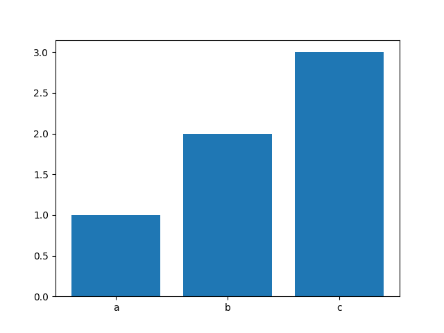

# Aula 07 - Processador de texto (continuação)

## Exercícios

1. Crie uma função `dicionario_para_listas` que recebe um dicionário, e retorna 2 listas, uma com as chaves do dicionário e outra com os valores.

Exemplo:
```python

d = {
	"a": 1,
	"b": 2,
	"c": 3
}

chaves, valores = dicionario_para_listas(d)

print(chaves)  # ["a", "b", "c"]

print(valores) # [1, 2, 3]
```

> Nota: uma função pode retornar mais que um elemento. Nestes casos, podemos "desempacotar" este retorno em mais que uma variável. Vejamos o seguinte exemplo:
```python
def divisao(a, b):
	q = a // b # calcular o quociente
	r = a % b # calcular o resto
	return q, r
```

A função `divisao` é uma função que recebe dois inteiros `a` e `b` e retorna o quociente e o resto da divisão inteira destes 2 números.
```python
quociente, resto = divisao(5,2)

print(quociente) # 2
print(resto) # 1
```
Aqui, estamos a pegar nos 2 resultados que são devolvidos pela função `divisao`, e estamos a associar o primeiro à variável `quociente` e o segundo à variável `resto`.


2. Crie uma função `desenha_grafico_de_barras` que recebe o dicionário de ocorrências e gera um gráfico de barras que associa cada palavra ao seu número de ocorrências.

Utilização:
```python
desenha_grafico_de_barras(d) # deve gerar o gráfico de acordo com o dicionário de ocorrências d
```

Para isto vamos utilizar a biblioteca `matplotlib`.
Vejamos o seguinte exemplo:
```python
from matplotlib import pyplot as plt

xx = ["a", "b", "c"]
yy = [1, 2, 3]

plt.bar(xx, yy) # construir o gráfico

plt.show() # desenhar o gráfico
```

Isto gera a seguinte figura:



3. Como deve ter reparado, o gráfico fica ilegível devido à eleveda quantidade de palavras que temos no nosso texto.
Para melhorarmos isto, vamos apenas desenhar no gráfico as `n` palavras mais ocorridas.

Altere a função `desenha_grafico_de_barras` de modo a também receber um argumento inteiro `limite` que indica que apenas vamos desenhar as apenas as $n$ palavras mais ocorridas no texto.

```python
desenha_grafico_de_barras(d, 10) # apenas desenha as 10 palavras mais ocorridas no texto
```

> Nota: para resolver este exercício, acrescente a seguinte função ao código e faça uso dela:
```python
def ordena_duas_listas(lista_base, outra_lista):
	lista_base_ordenada = [x for x, _ in sorted(zip(lista_base, outra_lista))]
	outra_lista_ordenada = [y for _, y in sorted(zip(lista_base, outra_lista))]

	lista_base[:] = lista_base_ordenada
	outra_lista[:] = outra_lista_ordenada
```

### Extras
4. Crie uma função semelhante à `desenha_grafico_de_barras` chamada `desenha_grafico_circular` que desenha um gráfico circular.

Utilização:
```python
desenha_grafico_circular(d, 10)
```

Exemplo:
```python
from matplotlib import pyplot as plt

labels = ["a", "b", "c"]
valores = [1, 2, 3]

plt.pie(valores, labels=labels)

plt.show()
```

Isto gera a seguinte figura:


5. Melhore o programa de forma a que o utilizador possa escolher o que desenhar: a nuvem de palavras, o gráfico de barras, o gráfico circular, ou todas as opções.


